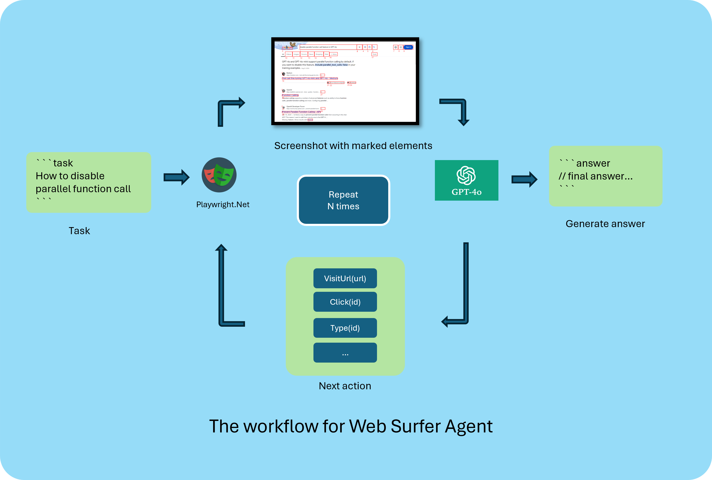

# Web Surfer Agent

Automate web surfing using GPT-4o and playwright.Net

> [!Note]
> This project is modified from the [WebSurferAgent](https://github.com/microsoft/autogen/blob/main/autogen/agentchat/contrib/web_surfer.py).
> With a few modifications to better follow the dotnet style.
> The original project is written in python and uses playwright-python.
> The tag_utils.js is copied from https://github.com/reworkd/tarsier, with little modification to return the list of interactive elements.



## Demo


## Getting Started

### Pre-requisites
- `dotnet 8.*`

### Installation
- Clone the repository
- restore dotnet tool
```bash
dotnet tool restore
```
- build the project
```bash
dotnet build
```
- install required browser drivers using playwright.ps1
```bash
dotnet pwsh bin/Debug/net8.0/playwright.ps1 install
```
- run the project
```bash
dotnet run
```
